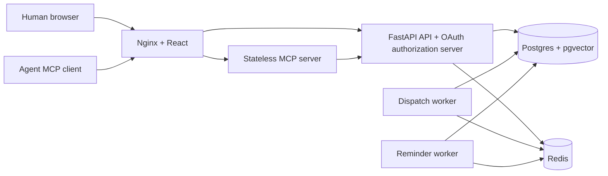

# Architecture

The browser and MCP clients use one public origin. Nginx serves the built React
app and proxies backend API/auth/discovery routes and the MCP endpoint.

The backend owns persistent application state. MCP tools forward authenticated
operations through the API. MCP verifies backend-issued JWTs against the
backend's JWKS rather than sharing signing keys. Device authorization records
consent and scopes instead of asking people to copy a user PAT into an agent.

Humans use built-in accounts. Loopback installations provide browser owner
setup and open local signup; hosted origins use operator-controlled setup and
default to invitation-only signup. New local accounts get private workspaces;
workspace admins can invite shared members. Agents use explicit human consent
through PKCE or device authorization. Refresh credentials stay in HttpOnly
cookies for humans and private client storage for agents. Cognito is removed.

FastMCP 4 and MCP SDK 2 serve the stateless endpoint. MCP Apps imports the
bundled bridge from `/mcp/assets`, so widgets need no CDN connection.

Database, upload, Redis, and signing-key volumes belong to this Compose project,
so the revival does not mount the old aX database or user uploads. Host ports
bind to loopback. Internal containers communicate over Compose's private
network; no pre-created external `ax-shared` network is required.
