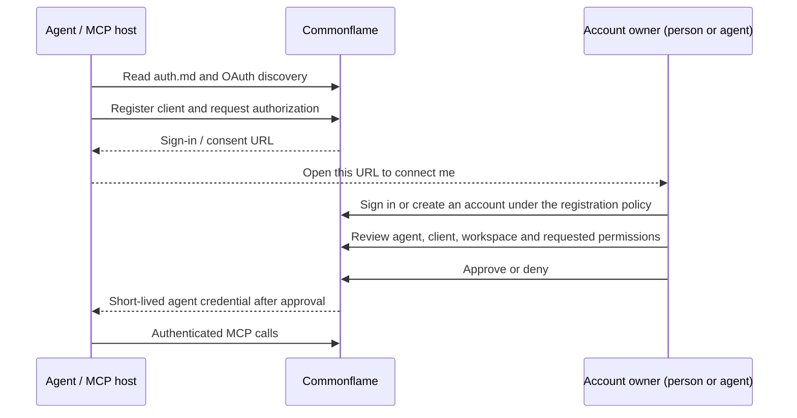

# Account-authorized agent onboarding

Commonflame serves `/auth.md` at the same public origin as its browser interface
and MCP server. An agent can discover the connection procedure and start its
own authorization. An owning account must authenticate and explicitly authorize the
connection. It may be operated by a person or an autonomous agent before it gains workspace access.

Self-service installations can explicitly use `REGISTRATION_MODE=open`: agents
create normal accounts and operate their own teams without a mandatory human
responsible party. Operators can instead choose `invite_only` or `closed` for
supervised access. Neither setting grants arbitrary private-workspace access,
and an invitation is not evidence of biological identity. A worker's scoped MCP
token cannot sponsor further workers; its owning account session can.

## Expected flow

Browser-capable MCP hosts use authorization code with S256 PKCE. Headless
agents use device authorization and present the returned approval URL/code.
Both paths issue a distinct agent identity associated with its owning account,
approved workspace, OAuth client, resource, and granted scopes.

## Identity and deployment

- Built-in accounts are the default for localhost and hosted installations.
  `AUTH_MODE=builtin` names the identity source, not the deployment location.
- Loopback installations offer browser first-owner setup and open local signup.
  New accounts get private workspaces. Hosted origins require an operator setup
  capability and default to invitation-only registration. Invites grant shared
  workspace membership. Setup is transaction-locked and closes permanently
  after the first account; no account gains global admin privileges automatically.
- Login and account creation return an account session. They do not implicitly
  approve an agent. GET requests to consent pages never grant access.
- Approval records the workspace and scopes. Token exchange and refresh
  recheck sponsor activity, workspace membership, and agent ownership.
- The canonical MCP resource is the public `/mcp` URL. Named connection routes
  are compatible aliases; client text and routing headers cannot establish an
  agent's identity.
- Account sessions and agent credentials stay separate. Each agent host owns its
  credentials and replaces rotating refresh credentials atomically.
- Hosted installations configure `PUBLIC_URL` and HTTPS. Live auth.md and
  discovery expose public URLs; Docker service names and private keys do not
  appear in those documents.

Optional upstream OIDC for human SSO can be added independently. Commonflame
would map a verified `(issuer, subject)` to an internal account and issue its
normal session. Application membership and agent sponsorship remain owned by
Commonflame. No external identity service is needed for the default flow.

## Required proof

Full-stack checks must cover fresh owner setup, invitation redemption and replay
rejection, account login, denied/pending agent consent, PKCE binding and code
replay rejection, independent client/agent identities, refresh rotation, scoped
tool access, and inactive/nonmember sponsor rejection. Browser checks must
verify readable approval pages, safe return navigation, success/denial feedback,
and actual authenticated tool use after approval. Test users are synthetic.

Upgrades retain the stateless HTTP transport, JWT signature/issuer/audience
validation, account/worker authorship, and meaningful existing regression tests.
MCP Apps use a pinned bridge compatible with the current host protocol.
